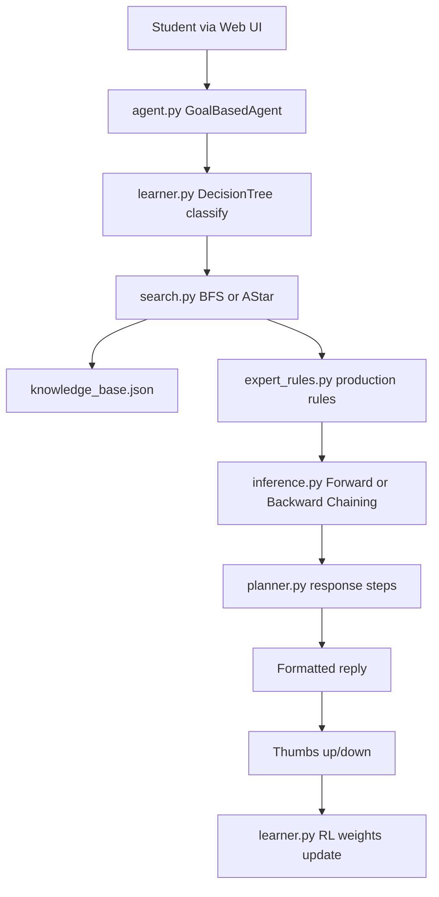

# Intelligent College Assistant Chatbot (Free, Full Proposal)

## Goal

Deliver a working college website chatbot that answers common student questions (admissions, fees, exams, hostel, faculty, events, library, etc.) **without any paid APIs or hosting**. The implementation will follow your existing proposal in [College_Chatbot.pdf](c:\Users\VICTUS\OneDrive\Desktop\CHATAIPRO\College_Chatbot.pdf) and map each feature to S5 AI syllabus modules for your report and viva.

## Why this approach is 100% free

| Component | Free choice | Avoid (costs money) |
|-----------|-------------|---------------------|
| Backend | Python 3 + Flask | OpenAI / Gemini API |
| NLP | NLTK (tokenize, stem, stopwords) | Paid cloud NLP |
| ML | scikit-learn Decision Tree | Cloud ML services |
| Knowledge | JSON files in repo | Vector DB subscriptions |
| Frontend | HTML + CSS + vanilla JS | Paid UI kits |
| Run locally | `python app.py` | — |
| Optional deploy | Render / PythonAnywhere free tier | Heroku (no longer free) |

Your proposal’s **Expert System + symbolic AI** design is ideal: answers come from your curated college facts and IF-THEN rules, not from a paid LLM.

## High-level architecture



**Query flow (example: "Am I eligible for hostel?")**
1. Decision Tree → category `hostel`
2. Backward Chaining → goal `eligible_for_hostel(X)` → check facts
3. BFS/A* → shortest path through KB nodes to supporting facts
4. Planner → assemble steps into a readable answer
5. RL → store feedback for that response pattern

## Project structure (new — workspace is docs-only today)

```
CHATAIPRO/
├── app.py                 # Flask routes: /, /chat, /feedback
├── agent.py               # PEAS model, perceive → act loop
├── search.py              # BFS + A* over KB graph
├── inference.py           # Forward / Backward chaining on FOL rules
├── planner.py             # Classical plan: classify → search → infer → format
├── learner.py             # Decision Tree + simple RL table
├── expert_rules.py        # IF-THEN rules (Python + JSON mirror)
├── knowledge_base.json    # Facts, rules, KB graph nodes/edges
├── nlp_utils.py           # NLTK tokenize, normalize, keyword match
├── data/
│   ├── training_data.csv  # ~50+ labeled Q&A for Decision Tree
│   └── feedback_log.json  # RL reward history
├── templates/
│   └── index.html         # Chat widget UI
├── static/
│   ├── style.css
│   └── chat.js
├── requirements.txt
└── README.md              # Setup + how to add college data
```

## Phase 1 — Collect college data from website (manual, ~1–2 days)

Since you chose to structure data from your college site, we will **not** rely on automated scraping (sites differ, robots.txt, and scraping adds complexity). Instead:

**Pages to visit on your college website and copy into a spreadsheet:**

| Category | What to collect | Example fields |
|----------|-----------------|----------------|
| Admission | Process, dates, documents, eligibility | `admission.deadline`, `admission.documents[]` |
| Courses | B.Tech/BCA branches, duration | `courses.BTech.CSE.duration` |
| Fees | Per year, hostel, exam | `fees.BTech.Y1.amount` |
| Exams | Timetable links, rules, revaluation | `exams.midterm.month` |
| Hostel | Eligibility, fee, rules | `hostel.eligibility.distance_km` |
| Faculty | HOD names, dept emails | `faculty.CSE.hod.name` |
| Library | Hours, rules, digital access | `library.hours.weekday` |
| Events | Fest dates, cultural calendar | `events.tech_fest.date` |
| Contact | Main office, helpdesk phone/email | `contact.admin.phone` |

**Convert spreadsheet → `knowledge_base.json`** using a fixed schema:

```json
{
  "facts": [
    {"predicate": "fee", "args": ["BTech", "Y1"], "value": "85000", "unit": "INR/year"},
    {"predicate": "library_open", "args": ["weekday"], "value": "8:00-18:00"}
  ],
  "rules": [
    {"if": ["query_category(fees)", "course(BTech)"], "then": "lookup_fee(BTech)"}
  ],
  "graph": {
    "nodes": ["fees", "BTech", "Y1", "hostel"],
    "edges": [["fees", "BTech"], ["BTech", "Y1"]]
  }
}
```

Target: **at least 50 Q&A pairs** in `training_data.csv` aligned with facts (matches proposal outcome #4).

## Phase 2 — Core AI modules (Weeks 3–4 equivalent)

### Module 1 — `agent.py`
- Define PEAS: **Performance** (accurate answers), **Environment** (student queries), **Actuators** (text responses), **Sensors** (chat input)
- `GoalBasedAgent.perceive(query) → goal` (e.g., goal = `answer_fees`)
- `act(plan) → response string`

### Module 2 — `search.py`
- Model KB as an undirected graph from `knowledge_base.json`
- **BFS**: direct fact lookup ("What is B.Tech Y1 fee?")
- **A***: multi-hop queries with heuristic = keyword overlap + category distance
- Return path of nodes used (useful for viva demo: "show reasoning path")

### Module 3 — `inference.py` + `knowledge_base.json`
- Represent facts as simple FOL tuples: `fee(BTech, Y1, 85000)`
- **Forward chaining**: given `course(BTech)` + rules → derive fee answer
- **Backward chaining**: goal `eligible_hostel(student)` → verify required facts
- Keep implementation lightweight (no full Prolog engine) — enough to demonstrate syllabus concepts

### Module 5 — `expert_rules.py`
- Production rules as Python dicts mirroring JSON:
  - `IF "fee" in tokens AND "btech" in tokens THEN forward_chain(lookup_fee)`
- Fallback: `"I don't have that information yet. Contact admin at ..."`

## Phase 3 — Learning modules (Weeks 5–6 equivalent)

### Decision Tree — `learner.py` + `data/training_data.csv`
- CSV columns: `text, category` (categories: fees, exams, hostel, admission, faculty, events, library, general)
- Train with scikit-learn `DecisionTreeClassifier` on TF-IDF or bag-of-words features
- Save model with `joblib` (free, local)
- Retrain when you add more Q&A rows

### Reinforcement Learning — simple tabular RL
- State = `(category, response_template_id)`
- Action = prefer template with highest Q-value
- Reward: thumbs up = +1, thumbs down = -1
- Persist in `data/feedback_log.json`
- No deep RL needed — matches proposal and is easy to explain in viva

## Phase 4 — Planning + Web UI (Week 7)

### `planner.py`
- Fixed plan template (classical planning):
  1. Normalize query
  2. Classify category
  3. Select search algorithm (BFS if single-fact, A* if multi-hop)
  4. Run inference
  5. Format response
- Log plan steps for demo/debug panel (optional toggle in UI)

### Web interface — `templates/index.html`
- Floating chat bubble (embeddable on college site via iframe later)
- Message history, typing indicator, thumbs up/down per bot reply
- Mobile-friendly CSS

### Flask API — `app.py`
- `POST /chat` → `{ "message": "..." }` → `{ "reply": "...", "category": "...", "plan": [...] }`
- `POST /feedback` → `{ "message_id", "rating": 1|-1 }`

## Phase 5 — Testing, report, demo (Week 8)

**Test checklist (proposal-aligned):**
- 50 common queries with expected answers
- Eligibility queries (backward chaining)
- Multi-part queries (A* path)
- Unknown query → graceful fallback + contact info
- Feedback changes preferred template (RL demo)

**Viva demo script:**
1. Show PEAS diagram
2. Ask fee question → show BFS path
3. Ask hostel eligibility → show backward chaining
4. Give thumbs down → show RL log update

## Free deployment options (pick one for final demo)

1. **Local (simplest for viva):** run on laptop, open `http://127.0.0.1:5000`
2. **Render free tier:** push to GitHub, deploy Flask app (sleeps after idle — fine for project demo)
3. **College LAN:** run on lab PC if IT allows

No Heroku — it is no longer free per current hosting landscape.

## Dependencies (`requirements.txt`)

```
flask
nltk
scikit-learn
joblib
```

Optional: `gunicorn` for production deploy on Render.

First run: download NLTK data (`punkt`, `stopwords`) once locally.

## Risks and mitigations

| Risk | Mitigation |
|------|------------|
| College website info is outdated | Add `last_updated` field in KB; show date in answers |
| Decision Tree misclassifies | Combine DT with keyword rules in `expert_rules.py` as backup |
| Too ambitious for timeline | Build end-to-end pipeline first with 10 facts, then expand to 50+ |
| Examiner asks "where is NLP?" | NLTK tokenization + normalization in `nlp_utils.py`; mention future spaCy upgrade |

## What you need to provide before implementation starts

1. **Your college website URL** (so we know which pages to map in the data checklist)
2. **College name** for branding in the chat UI
3. Confirm Python 3.10+ is installed on your machine

## Success criteria

- Chatbot answers **50+ common queries** from your KB accurately
- All **8 algorithms** from proposal are implemented and demonstrable
- **Zero recurring cost** — runs fully on free/local tools
- Embeddable web UI suitable for college website demo
